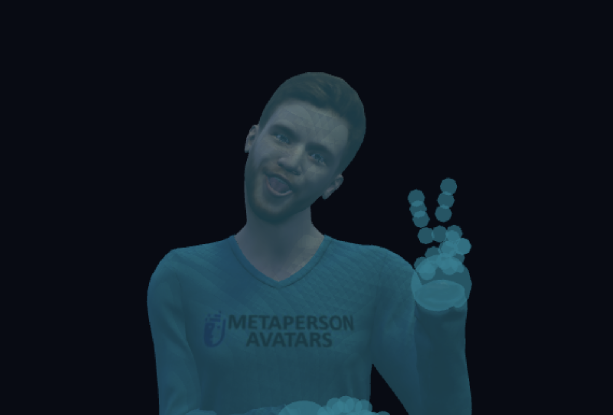

# FaceFill

## Project Summary

I read Snow Crash a while back, and one aspect that stood out was the focus on avatars — especially Juanita’s push for realistic facial expression.

I’m sad about Meta’s decision to drop self-facing tracking on Quest Pro to cut cost. VR glasses shouldn’t only put you in another world; they should help that world adopt *you*.

Affordable options are scarce (mostly custom mounted cameras), which prompted this project: train a net on lower-face motion to predict the occluded upper face, so virtual conversations feel more alive.

## Try it out



[Download Model](https://huggingface.co/dabanba/FaceFill)
[Train w/ My Notebook](notebooks/train_facefill.ipynb)

| Role | URL |
|------|-----|
| VR (Quest) | https://dabanba.com:3000/vr.html |
| FaceCam (PC) | https://dabanba.com:3000/companion.html |

## Data prep

**Source:** [MEAD](https://wywu.github.io/projects/MEAD/MEAD.html) — acted emotional speech, frontal camera only.

**Pipeline:**

```
MEAD .mp4 (front)
  → MediaPipe Face Landmarker (ARKit-52 blendshapes / frame)
  → NPZ sequences  (full_morphs [T,52], head, confidence, meta)
  → person-disjoint train / val / test
  → windowed Dataset  (seq 128, burn-in 32)
```

**This run’s mix** (Drive quota limited full download — 1 actor per split):

| Split | Actor | Clips | ~frames |
|-------|-------|------:|--------:|
| train | M033 | 659 | 91k |
| val | W015 | 664 | 82k |
| test | W009 | 656 | 90k |

Eight emotions (angry, contempt, disgusted, fear, happy, neutral, sad, surprised), roughly balanced; neutral is thinner. Splits are by person, never by frame, so test measures cross-identity generalization.


## Morph contract

| Group | Count | Role |
|-------|------:|------|
| Lower face | 30 | Observed under HMD (jaw, mouth, cheeks, nose) |
| Upper face | 11 | Predicted (blinks, squint, wide, brows) |
| Full ARKit | 52 | Assembled avatar output |

Gaze (8) is left external. Model inputs: `current[80]`, `history[176]`, `u_prev[11]`.


## Model — FaceFill (~3.36M params)

Current/history MLPs → 384-wide GRU×3 → absolute + residual heads blend into `û`; uncertainty and blink heads support loss / runtime blink control. Stage 1 teacher-forced; Stage 2 scheduled sampling + short AR rollout for streaming step.

### Block diagram

```
current [80]  → MLP → 256 ─┐
history [176] → MLP → 256 ─┴→ fuse → GRU×3 (384)
                                      │
                    AbsHead        ResHead      UncHead / BlinkHead
                    u_abs          Δu           log_var / onset·dur·amp
                         └──→ û = blend(u_prev, Δu, u_abs) ←──┘   (loss / blink ctrl)
```

### Combine rule

```
û_t = clamp( α · (u_{t-1} + Δu_t) + (1 − α) · u_abs_t ) ,   α = 0.8
```

| Symbol | Meaning |
|--------|---------|
| `û_t` | predicted upper (11-D) |
| `u_{t-1}` | previous upper (GT or predicted) |
| `Δu_t` | residual, capped ±0.15 |
| `u_abs_t` | absolute upper |
| `α` | 0.8 — favors residual path |

### Stage 2 — scheduled sampling (train only)

```
u_{t-1} ←  u_GT_{t-1}   with probability p_tf   (anneals 0.95 → 0.10)
           û_{t-1}      otherwise
```

Deploy / Stage-2 val: always `û` (pure AR).

### Test result (AR) — held-out W009

| Metric | Value |
|--------|------:|
| mean MAE | **0.075** |
| mean Pearson | **0.82** |
| blink F1 | **0.73** |
| step (MPS) | ~1.5 ms |

```
browInnerUp      ████████████████████████████████  0.151
eyeSquintLeft    ███████████████████████████       0.129
browOuterUpRight ███████████████████████████       0.127
eyeSquintRight   █████████████████████             0.103
browOuterUpLeft  ████████████████████              0.096
eyeBlinkLeft     ███████████████                   0.070
eyeBlinkRight    ███████████████                   0.069
eyeWideRight     ██████                            0.029
eyeWideLeft      ████                              0.021
browDownRight    ███                               0.017
browDownLeft     ███                               0.017
                 0        0.05      0.10      0.15   ← MAE (lower better)
```

Hardest: inner brow + squint. 

Easiest: brow-down + eye-wide.

---

## Tracking

### Head & hands (Quest)

Three.js + WebXR. Each frame: head from `XRViewerPose`, up to 25 joints per hand via Hand Tracking API. Poses sent ~20 Hz over WebSockets.

### Lower face → FaceFill (PC companion)

MediaPipe Face Landmarker on the webcam yields ARKit blendshapes. The companion runs FaceFill ONNX on the lower-face channels to complete upper-face morphs, then applies the full set to the avatar and relays over the same room WebSocket.
